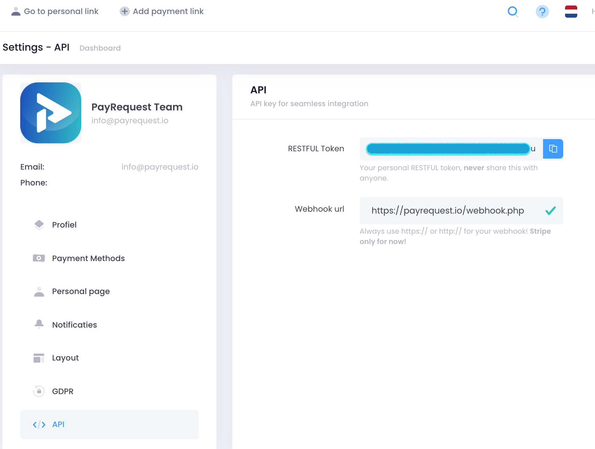

# Webhooks

## Setup Webhooks

Just navigate to Settings -&gt; API and fill in your Webhook URL:




 Super-powers are granted randomly so please submit an issue if you're not happy with yours.


Once you're link: personallink &lt;-- indien personal payment of link id als het een paymentlink is amount: amount &lt;-- spreekt voor zich?

indien recurring: count: X &lt;-- aantal keer betaald

indien paymentlink: status: eigenlijk altijd PAID

indien personallink: user, email, note &lt;-- spreekt voor zich? enough, save the world:


```bash
# Ain't no code for that yet, sorry
echo 'You got to trust me on this, I saved the world'
```




Link ID



If it is a 






personallink or linked











S










```
Sample output
```






