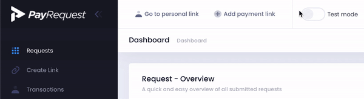
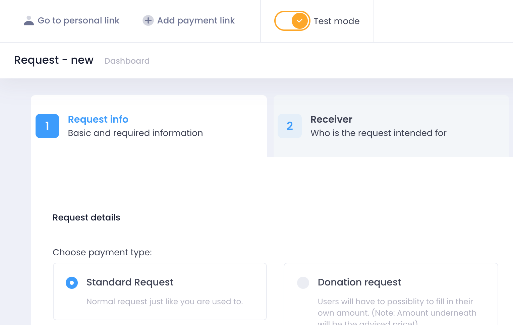
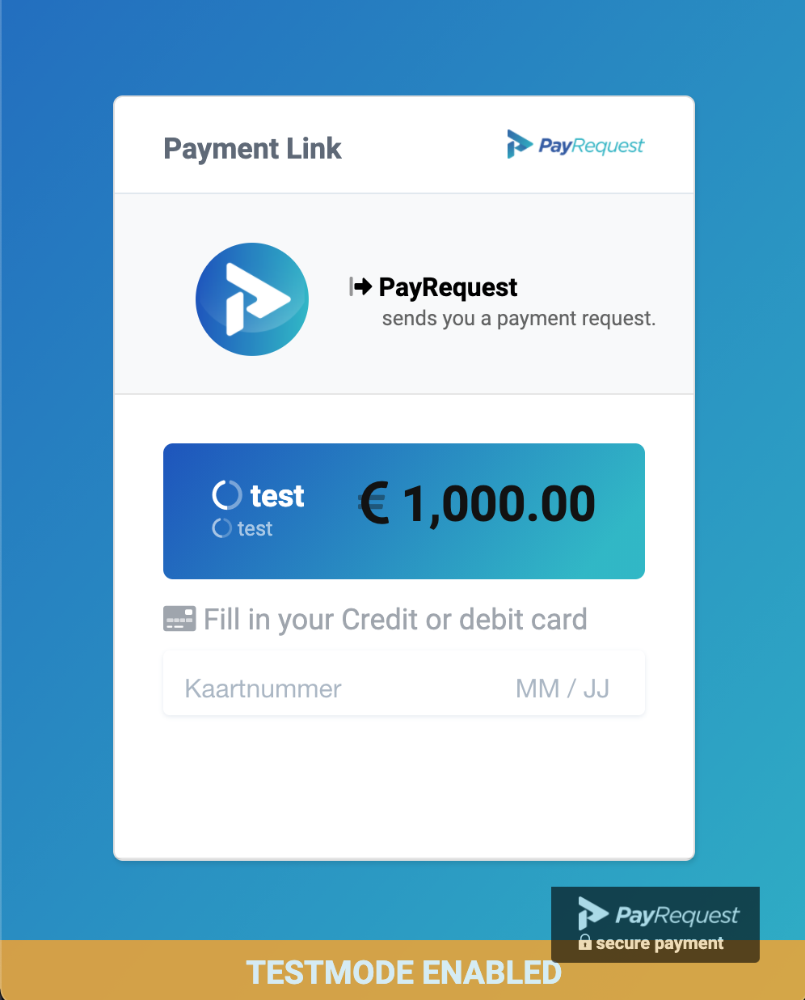

# Test Mode


Test Mode \(currently\) only works with Payment Provider: Stripe,  for more information about Stripe Testing:  [https://stripe.com/docs/testing](https://stripe.com/docs/testing)


## 1. Enable Test Mode

 You can simply enable test mode via our dashboard:

## 2. Create a new payment link

Now just create a payment link, and it will be automatically a test-mode payment link.

## 3. Make a payment with Test Mode

After you created a payment link, you will see on the payment link that test mode is active:

### Credit Cards to make test payments

Below you see a full list of all credit card you can use for testing purposes, for other payment methods like iDeal you don't have to fill in anything.

* No authentication \(default U.S. card\): `4242 4242 4242 4242`.
* Authentication required: `4000 0027 6000 3184`.

**Full list of Credit Cards for testing purposes**

| NUMBER | BRAND | CVC | DATE |
| :--- | :--- | :--- | :--- |
| 4242424242424242 | Visa | Any 3 digits | Any future date |
| 4000056655665556 | Visa \(debit\) | Any 3 digits | Any future date |
| 5555555555554444 | Mastercard | Any 3 digits | Any future date |
| 2223003122003222 | Mastercard \(2-series\) | Any 3 digits | Any future date |
| 5200828282828210 | Mastercard \(debit\) | Any 3 digits | Any future date |
| 5105105105105100 | Mastercard \(prepaid\) | Any 3 digits | Any future date |
| 378282246310005 | American Express | Any 4 digits | Any future date |
| 371449635398431 | American Express | Any 4 digits | Any future date |
| 6011111111111117 | Discover | Any 3 digits | Any future date |
| 6011000990139424 | Discover | Any 3 digits | Any future date |
| 3056930009020004 | Diners Club | Any 3 digits | Any future date |
| 36227206271667 | Diners Club \(14 digit card\) | Any 3 digits | Any future date |
| 3566002020360505 | JCB | Any 3 digits | Any future date |
| 6200000000000005 | UnionPay | Any 3 digits | Any future date |

## 

Now you can insert a credit card, or use any other payment method, if you use for example iDeal you will be redirected to Stripe landing page where you can authorize the test payment or even let it will.

After clicking 'Authorize Test Payment' you will be automatically redirected to payment link, and you will that it is paid.

## 4. Your test-mode payment link is paid.

## 5. Disable Test Mode

When you are done with testing, please disable test mode.

Contact the PayRequest Team if you need any help.

