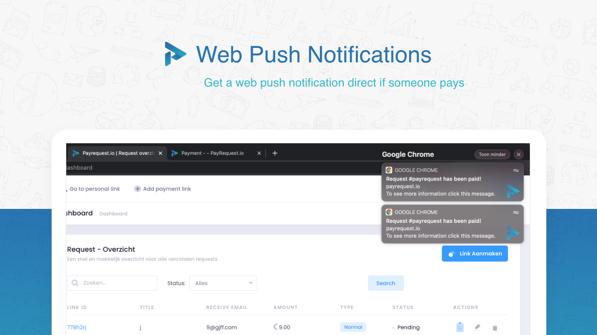
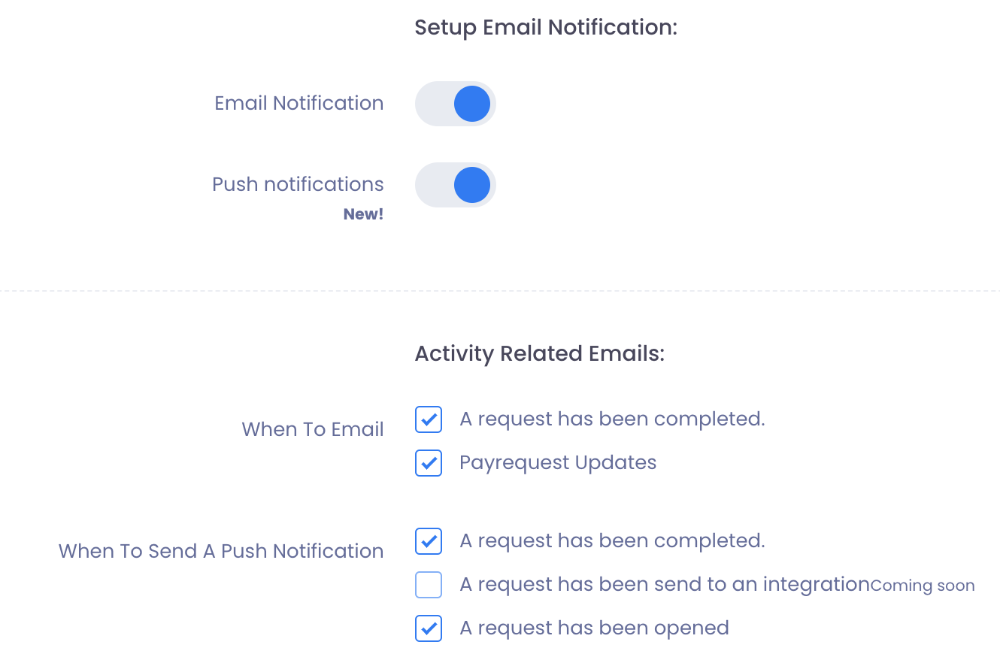

# Web Push Notifications 🔔

## Receive a notification in your browser every time a request has been paid. 

web\(browser\) push notifications are messages from a website you receive in your browser.


 Web Push Notifications are supported by the following browsers:


## How to setup Web Push Notifications

To enable Web Push Notifications you need to go to **Settings -&gt; Notifications** tab.

Issues or do you need any help? please email us: info@payrequest.io

