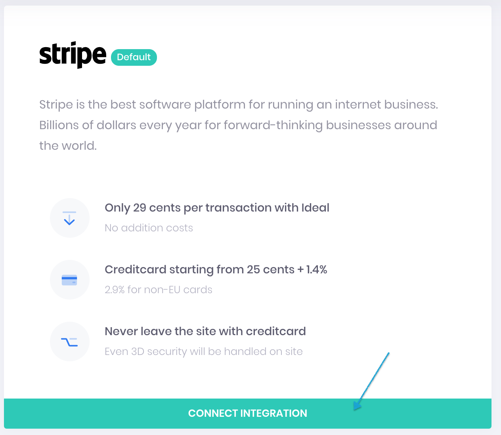
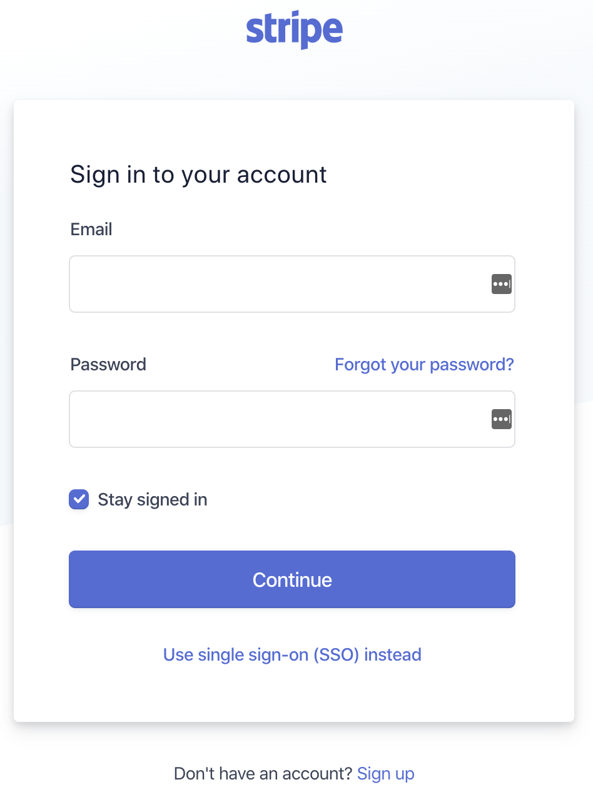
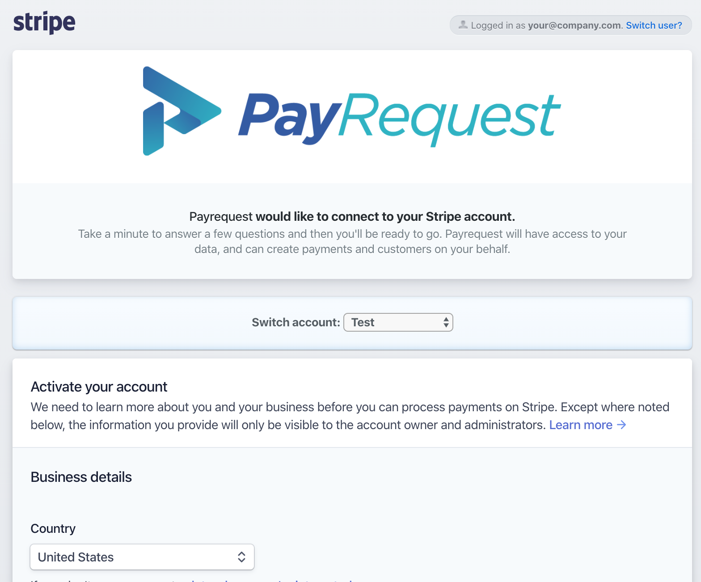
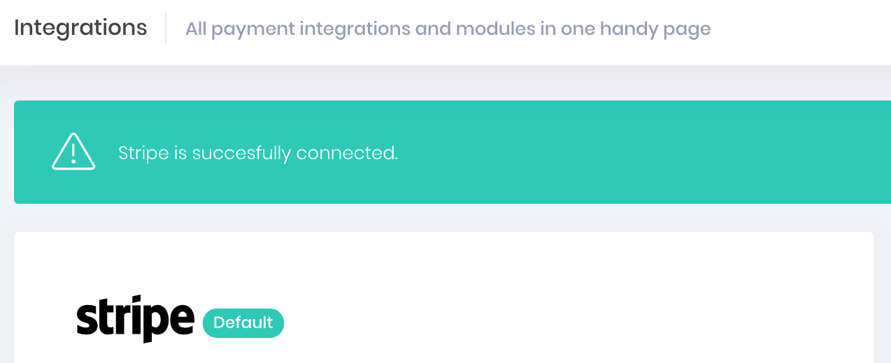

# Connect your Payment Provider

## ➡️ Go to Integrations page

Please go to [https://dashboard.payrequest.io/dashboard/integrations](https://dashboard.payrequest.io/dashboard/integrations) here you can see all available payment providers that you can connect with your account.

## 💳 Connect your first Payment Provider

To start using PayRequest you need at least one active payment provider, it is no problem if you never used one because after connect you can direct signup for it.

### 1. Click on the integration button

### 2. Signup or login with your Stripe account.

### 3. Activate your Stripe account

### 4. Your Stripe account is now connected!

